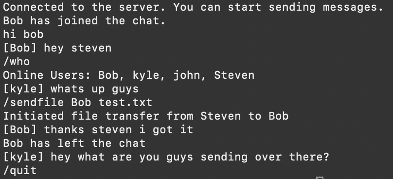

# JavaChatServer

## Description 
This project implements a multithreaded TCP client–server system in Java, allowing multiple clients to connect, chat, and share files simultaneously.

## Requirements
- Java 11 or higher
  (The project uses single-source file execution, which requires Java 11+.)

## Table of Contents
- [Installation](#installation)
- [Usage](#usage)
- [Command](#commands)

## Installation
1. Clone the repository:
   ```bash
   git clone https://github.com/phtevesn/JavaChatServer.git

2. Navigate to project repository:
   ```bash
   cd JavaChatServer
   
## Usage
1. Start server with port number
   ```bash
   java tcpcss.java [port]

   #example usage
   java tcpcss.java 12345

2. Connect to server with client
   ```bash
   java tcpccs.java [address] [port] [name]

   #example usage
   java tcpccs.java 127.0.0.1 12345 Steven

## Commands
- /sendfile <user> <filename> – Requests a file transfer with another client.
- /acceptfile <user> – Accepts a pending file transfer.
- /rejectfile <user> – Declines a file transfer request.
- /who - Shows a list of online users.
- /quit – Closes the connection and exits the program.

## Example Usage
### Example user: Steven


### Example user: Bob

